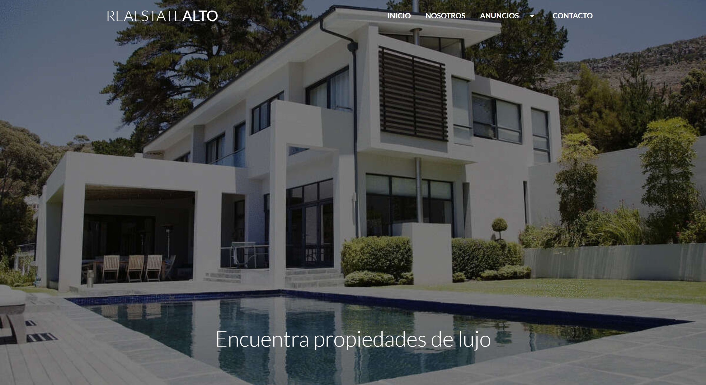

# Web page design for Real State Company

This project is a web page design created for a real estate company, showcasing properties for sale, information about the company, and providing an engaging visual experience for users interested in real estate. You can view the demo [here](https://iaosan.github.io/bienes-raices-layout/).

## Screenshots



## Setup

Follow these steps to install and run the project on your local machine.

**1. Clone the repository:**

```
git clone https://github.com/IAOsan/bienes-raices-layout.git
cd bienes-raices
```

**2. Install dependencies:**  
Ensure you have Node.js and npm installed on your machine. Then, run:

```
npm install
```

**3. Compile the project**  
This command will compile PUG and SASS and start a local server with Browser-Sync.

```
npm run start
```

Or you can compile the project in watch mode. This command will use Concurrently to run Pug and Sass compilation scripts in watch mode, in addition to starting a local server with Browser-Sync.

```
npm run dev
```

**4. Access the project locally**  
Open your browser and visit http://localhost:3000 to see the project in action. Remember, you can stop the local server and watch scripts at any time by pressing Ctrl + C in the terminal.
Ready! Now you should have the project installed, compiled, and running on your local machine.

## Usage

This layout was designed for a real estate agency. The key sections of the layout and how to navigate through them are described below:

**1. Properties for sale**
The "Properties for Sale" section displays a list of properties available for purchase.

**2. Information about company's services**
Access the "More About Us" section to learn more about the real estate agency. Here, you will find details about the company.

**3. Blog**
Explore the blog to find articles related to home remodeling and related topics.

> Note: This project is primarily a static layout and does not require complex interaction. Navigate through different sections by clicking on the links and exploring the available content.

## Technologies Used

#### Core Technologies

- Pug
- Materialize - version 1.0.0
- Sass

#### Development Dependencies

- Concurrently - version 8.2.2
- Sass - version 1.69.7
- Pug - version CLI 1.0.0-alpha6
- Browser-Sync - version 2.29.3

## Acknowledgments

This project was developed based on a course taught by [Juan Pablo De la Torre Valdez (codigoconjuan)](https://github.com/codigoconjuan).
